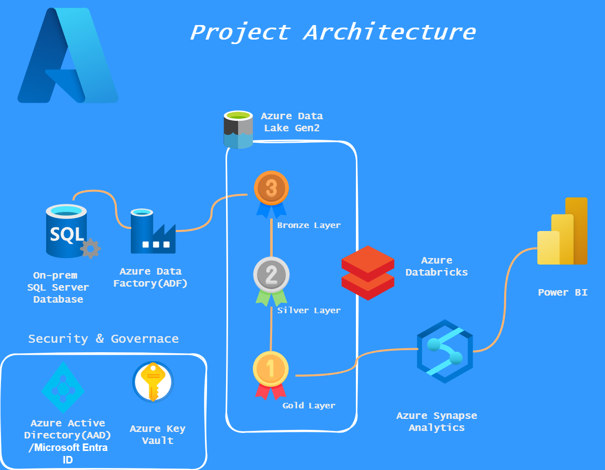

# e2e-Azure-real-time-project

# End-to-End Azure Data Engineering Project

This project demonstrates a real-time Azure Data Engineering pipeline using the modern medallion architecture.

##  Technologies Used
- Azure Data Factory (ADF)
- Azure Data Lake Gen2 (Bronze → Silver → Gold)
- Azure Databricks (PySpark & Delta Lake)
- Azure Synapse Analytics (Serverless SQL)
- Power BI (reporting)
- Azure Active Directory + Key Vault (Security)

## Architecture Diagram

##  Workflow

1. Ingest data from on-prem SQL Server into Bronze (ADF)
2. Transform raw data to Silver (Databricks)
3. Aggregate to Gold (Databricks)
4. Create dynamic views in Synapse Analytics (SQL script)
5. Visualize in Power BI

## 🔐 Security

- **Azure Active Directory**: Manages access via role-based permissions
- **Azure Key Vault**: Secures secrets (e.g., connection strings)

## 📊 Outputs

- Optimized Delta tables in each layer
- Serverless SQL views accessible in Synapse
- Interactive dashboards in Power BI
